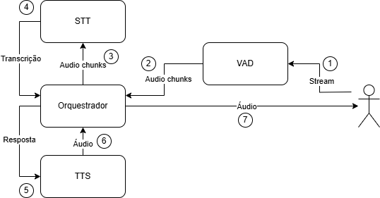
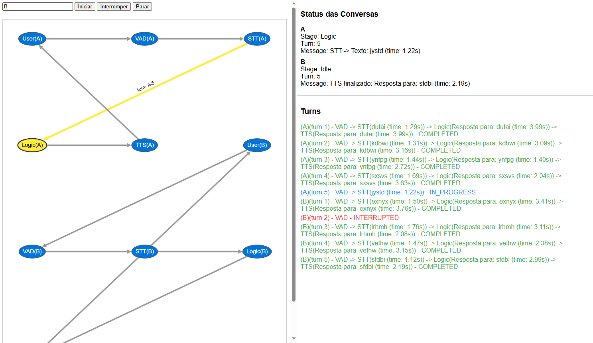

# Multi-Conversation Speech Processing Pipeline

Este repositório apresenta um projeto para simulação de um pipeline de processamento de fala com múltiplas conversas simultâneas. O sistema utiliza módulos simulados para VAD (Voice Activity Detection), STT (Speech-to-Text), Processamento Lógico e TTS (Text-to-Speech), orquestrados de forma assíncrona. 

## Visão Geral do Projeto

O projeto é composto por dois principais arquivos Python:
- **`app.py`**: Implementa um servidor FastAPI para simular a interação com a interface web.
- **`multi_conversation_system.py`**: Implementa a lógica principal do orquestrador para gerenciar múltiplas conversas simultaneamente.

## Estrutura do Pipeline

O pipeline segue os seguintes passos:
1. **VAD (Voice Activity Detection)**: Detecta se há fala no fluxo de áudio.
2. **STT (Speech-to-Text)**: Transcreve o áudio detectado em texto.
3. **Processamento Lógico**: Interpreta o texto e gera uma resposta adequada.
4. **TTS (Text-to-Speech)**: Converte a resposta textual em áudio para o usuário.

### Fluxograma do Sistema



## Simulação



A interface exibe um grafo dinâmico representando os estados das conversas em tempo real. Cada nó representa um dos estágios do pipeline. Abaixo está um exemplo da interface:

### 1. Iniciar o Servidor FastAPI

Em outro terminal, execute:
```sh
$ python app.py
```

ou

```sh
$ uvicorn app:app --port 8000
```

O servidor iniciará em `http://127.0.0.1:8000/`.

### 2. Interagir com a Interface Web
Abra `http://127.0.0.1:8000/` no navegador para visualizar a simulação das conversas.

### Funcionalidades
- Suporte a **múltiplas conversas simultâneas**.
- **Detecção de fala (VAD)** para iniciar uma nova transcrição.
- **Transcrição de fala em texto (STT)** simulada.
- **Processamento lógico** que gera uma resposta fictícia.
- **Conversão de texto para fala (TTS)** com tempo ajustável.
- Interface visual interativa para acompanhar o fluxo de dados.
- Possibilidade de interromper e parar conversas em andamento.
- Suporte a interrupção de conversas ativas por novas conversas.

## Personalização
O código está estruturado de forma modular. Caso queira substituir os módulos simulados por modelos reais:
- Substitua `STTMock` por um serviço real de STT (exemplo: Whisper, Wav2vec, etc.).
- Modifique `LogicMock` para integrar um assistente conversacional.
- Utilize um motor de síntese de fala real no `TTSMock` (exemplo: XTTS, etc.).
